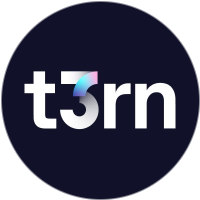

<!-- Display a banner -->

<!-- Center-align the clickable badge -->

 
    
    
    
    
    

    Xin chào! Tôi là Fat, và tôi là thực tập sinh trong các lĩnh vực validator, DevOps và hệ thống. Tôi có niềm đam mê sâu sắc với công nghệ blockchain và thích chia sẻ kiến thức cũng như kinh nghiệm của mình với cộng đồng. Tài khoản này được tạo ra để ghi lại hành trình phát triển cá nhân của tôi và chia sẻ những thông tin giá trị mà tôi đã tích lũy được trong quá trình này.

    Tôi đã đóng góp cho nhiều dự án blockchain, đặc biệt là cung cấp các bằng chứng xác minh (proofs) cho các dự án trong hệ sinh thái Cosmos. Những nỗ lực của tôi nhằm xây dựng và duy trì tính minh bạch và an toàn cho các hệ thống blockchain mà tôi tham gia.

    Bên cạnh đó, tôi đặc biệt chú trọng đến việc chia sẻ kiến thức và hướng dẫn các dự án trong cộng đồng Việt Nam, giúp phát triển và hỗ trợ hệ sinh thái blockchain địa phương.

    Tôi rất háo hức được chia sẻ và kết nối với bạn khi chúng ta cùng khám phá thế giới công nghệ blockchain!

 

# My collections
**Mainnet**

    

 

**Testnet**

    
    
    <a style="margin: 3px; border: 3px  border-radius: 50%;" href="https://nesa.ai/" target="_blank" rel="noreferrer">
    
    
    
</a>

 
 

# My Guides

    <table style="width: 800px;">
        <tr>
            <td style="cursor: pointer; text-align: center;">
                
            </td>
            <td style="cursor: pointer; text-align: center;">
                
            </td>
        </tr>
        <tr>
            <td style="cursor: pointer; text-align: center;">
                
            </td>
            <td style="cursor: pointer; text-align: center;">
                
            </td>
        </tr>
    </table>

